<!--
  SETUP — 4 things to do before this goes live:
  1) This file + the /assets folder need to live in a public repo named
     EXACTLY your GitHub username (e.g. github.com/kavindu/kavindu).
     That's the one repo GitHub renders on your profile page.
  2) Find/replace Kavindu9 below (appears in the stats,
     streak, top-languages, contribution-snake and visitor-count links)
     with your real GitHub username.
  3) Swap the LinkedIn placeholder link near the top for your real profile.
  4) The animated snake in "Live Telemetry" needs one extra step: keep
     the included .github/workflows/snake.yml file in the repo too. It
     runs automatically (daily + on every push) and generates the two
     SVGs the snake images point at — nothing to run by hand, just give
     it a few minutes after your first push. If it ever fails with a
     permissions error, go to Settings → Actions → General → Workflow
     permissions and set it to "Read and write permissions".
  The dashboard banner itself already animates on its own: the gauges
  sweep in on load, the status dot pulses, the "Now Building" bars move
  like a live equalizer, and the terminal cursor blinks. The three
  proficiency panels further down (Front-End / Back-End / Database)
  animate the same way — each bar fills in on load, cascading top to
  bottom. None of that needs setup, it's baked into the SVGs.
  Everything else is already filled in from what you'd told me.
-->

<div align="center">



<a href="https://kavindu.online">
  
</a>

<br/>

[](mailto:kavinduliyo@gmail.com)
[](https://kavindu.online)
[](https://www.linkedin.com/in/kavindu-liyanaarachchi-693516146/) <!-- replace your-linkedin -->

</div>

<br/>

## 🧭 Dashboard Readout
 
Full-stack engineer running **Axion Digital (Pvt) Ltd** out of Colombo, Sri Lanka — six-plus years shipping web applications, agency client sites, and AI-integrated tools across Sri Lanka and the Maldives (PULSE Hotels & Resorts, Crown Investments, AASL). BSc (Special Honours) in IT from SLIIT, with an IEEE-published research project (**VEHIA**) along the way.
 
Comfortable moving between PHP/Laravel, React/Next.js, Java/Spring Boot, and WordPress/WooCommerce depending on what the build calls for — and lately wiring AI (Claude, Gemini, Cloud Vision, OCR) into otherwise ordinary business tools. Fluent in English and Sinhala.
 
<br/>
## ⚙️ Engine Specs
 
**Full-Stack**
 


 
**CMS & Commerce**
 


 
**Data**
 


 
**AI & Integrations**
 


 
**Payments & Tools**
 


 
**Proficiency Breakdown**
 



<br/>
## 🚗 The Garage
 
Featured builds — a mix of shipped products, client platforms, and AI-integrated tools.
 
| Build | What it does | Stack |
|---|---|---|
| **StockGuard** | SaaS tool that checks Adobe Stock submissions for similarity conflicts before upload | PHP · MariaDB · Google Vision API · PayPal |
| **AxionPOS** | Point-of-sale system with parallel bill handling and role-based page permissions | PHP · MySQL · Bootstrap |
| **TenantPro + MyHome** | Property management admin panel with a companion tenant self-service portal | PHP · MySQL · Bootstrap 5 |
| **StockMS** | Stock management system with OCR invoice scanning | PHP · Tesseract OCR · Claude API |
| **JARVIS** | Personal AI assistant — a browser-based version plus a Python desktop app | Python · Gemini API · JavaScript |
| **HR, Attendance & Payroll System** | Leave, overtime and payroll management with biometric fingerprint device integration | PHP · MySQL · Bootstrap |
| **AI History Tutor** | Generative Q&A tutor built on a Grade 10 Sri Lankan history textbook | Generative AI · Q&A over a fixed knowledge base |
| **NOC Monitoring Wall** | View-only grid wall for live-monitoring multiple PCs, built for NOC-style displays | noVNC · websockify |
 
**What I build**
 
🌐 &nbsp;**Web Applications** — modern responsive websites · WordPress custom themes · ACF-powered content systems · custom booking interfaces · interactive landing pages · REST API integrations
 
🎨 &nbsp;**UI / UX** — responsive interfaces · animation-driven experiences · Tailwind CSS builds · Figma → production implementations
 
🤖 &nbsp;**AI / Machine Learning** — currently exploring:
```
AI
 │
 ├── Python
 ├── LLM Applications
 ├── LangChain
 ├── RAG
 ├── Document Processing
 └── AI-powered Web Applications
```
 
🎮 &nbsp;**Side Quests** — game development · Unity · digital art
 
<br/>
## 🏗️ Client Work — Axion Digital
 
- **Ayubo Property Management** — site for a Sri Lanka–based Airbnb management company
- **BRLF** (Business Reporting Leaders Forum) — Bootstrap 5 build for this Australian corporate-reporting organisation
- **Integrated Knowledge** — site for a Melbourne consultancy, built around a navy & gold brand
- WooCommerce plugins: a **PayHere payment gateway** and an **SL Invoice & Tax** add-on
- Several ThemeForest-ready WordPress theme demos
<br/>
## 📟 Live Telemetry
 
<!-- Replace Kavindu9 everywhere it appears below -->
<div align="center">
<!-- Generated by .github/workflows/snake.yml via our own script — no forked repo or PAT needed -->

<br/>

<br/>

<br/><br/>
 
<!-- Live contribution snake — needs .github/workflows/snake.yml (included) to generate the two SVGs below -->
<picture>
  <source media="(prefers-color-scheme: dark)" srcset="https://raw.githubusercontent.com/Kavindu9/Kavindu9/output/github-contribution-grid-snake-dark.svg" />
  <source media="(prefers-color-scheme: light)" srcset="https://raw.githubusercontent.com/Kavindu9/Kavindu9/output/github-contribution-grid-snake.svg" />
  
</picture>
</div>
<br/>
## 🛣️ Trip Log
 
- 🏁 **Founder** — Axion Digital (Pvt) Ltd, Colombo
- 6+ years across **PULSE Hotels & Resorts** (Maldives) · **Crown Investments** · **AASL** (Airport & Aviation Services Sri Lanka)
- 🎓 BSc (Special Honours), Information Technology — **SLIIT**
- 📄 IEEE-published researcher — **VEHIA**
<br/>
## ⛽ Fuel Gauge
 
What's currently in progress:
 
- Microsoft Azure fundamentals (AZ-900)
- LeetCode patterns — two-pointer, sliding window, Boyer-Moore, stack-based problems
<br/>
## 🌙 After Hours
 
- 🎬 Runs **Plot in Minutes**, a YouTube channel doing bilingual (EN/SI) movie & TV plot-summary Shorts, full script + SEO pipeline included
- 🛩️ Drone videography
- 📈 Technical / market analysis
<br/>
<div align="center">
---
 
*Thanks for pulling up — always happy to talk shop about full-stack builds or AI integrations.*
 
<!-- Replace Kavindu9 -->

 
</div>

---

*Thanks for pulling up — always happy to talk shop about full-stack builds or AI integrations.*

<!-- Replace Kavindu9 -->


</div>
